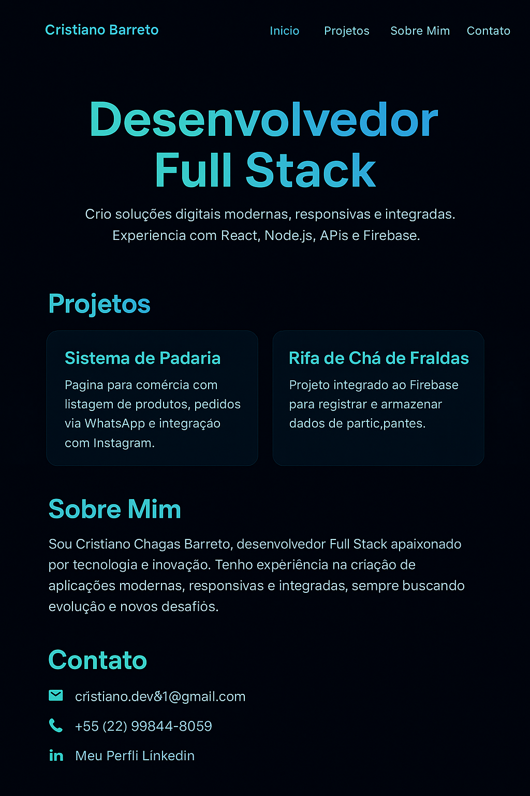

# 🌟 Landing Page Profissional - Cristiano Barreto



---

## 👋 Sobre mim

Olá, eu sou **Cristiano Chagas Barreto**, desenvolvedor **Full Stack** em constante evolução.  
Atualmente, desenvolvo aplicações modernas com **React, Node.js, JavaScript, MongoDB e Firebase**.  

Tenho experiência na criação de:
- Blogs e páginas institucionais.
- Landing pages modernas e responsivas.
- Sistemas integrados com APIs.
- Páginas para comércio (com pedidos via WhatsApp e integração com redes sociais).
- Projetos personalizados (como rifa de chá de fraldas integrada ao Firebase).  

---

## 🚀 Tecnologias utilizadas

- **React.js**
- **TailwindCSS**
- **Framer Motion**
- **JavaScript (ES6+)**
- **Firebase**
- **Git/GitHub**

---

## 🌐 Acesse a Landing Page

👉 [Landing Page no GitHub Pages](https://cristianogithub1.github.io/landingpage)

---

## 📬 Contato

- 📧 Email: **cristiano.dev81@gmail.com**  
- 📱 WhatsApp: **+55 (22) 99844-8059**  
- 💻 GitHub: [github.com/cristianogithub1](https://github.com/cristianogithub1)  
- 🧑‍💻 Workana: [Meu Perfil Workana](https://www.workana.com/freelancer/c689f5fb908488d439172d5ed45d209d)  
- 🔗 LinkedIn: [Meu Perfil LinkedIn](https://www.linkedin.com/in/cris-dev-barreto?utm_source=share&utm_campaign=share_via&utm_content=profile&utm_medium=ios_app)  

---

## ⚡ Como rodar o projeto localmente

```bash
# Clone o repositório
git clone https://github.com/cristianogithub1/landingpage.git

# Acesse a pasta do projeto
cd landingpage

# Instale as dependências
npm install

# Rode o servidor local
npm start
